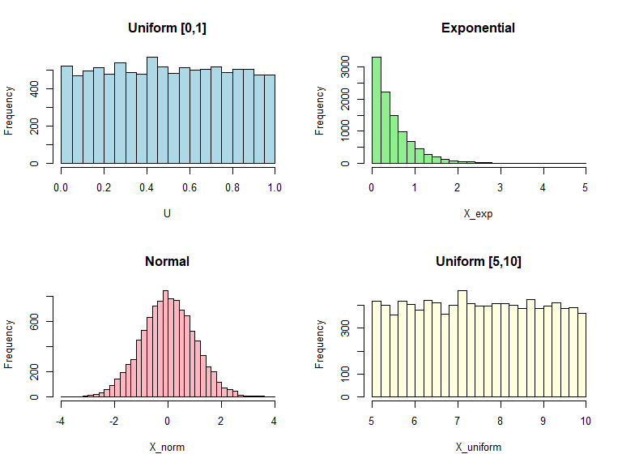

Universality of Uniform Distribution
================
Rajveer
2025-09-28

## 1. Simulate Uniform Random Numbers

We first generate uniform random numbers on $[0,1]$.

``` r
# Number of samples
n <- 10000

# Generate uniform random numbers on [0,1]
U <- runif(n)
head(U)
```

    ## [1] 0.2875775 0.7883051 0.4089769 0.8830174 0.9404673 0.0455565

------------------------------------------------------------------------

## 2. Transform Uniform to Other Distributions

### a) Exponential Distribution

If $X \sim \text{Exponential}(\lambda)$, the CDF is:

$$
F(x) = 1 - e^{-\lambda x}, \quad x \ge 0
$$

The inverse CDF is:

$$
F^{-1}(u) = -\frac{\log(1-u)}{\lambda}
$$

We can transform uniform samples to exponential samples:

``` r
lambda <- 2
X_exp <- -log(1 - U) / lambda
head(X_exp)
```

    ## [1] 0.16954209 0.77630468 0.26295011 1.07286505 1.41061464 0.02331342

------------------------------------------------------------------------

### b) Normal Distribution

For a standard normal distribution $X \sim N(0,1)$, we can use the
built-in `qnorm()` function (inverse CDF):

``` r
X_norm <- qnorm(U)
head(X_norm)
```

    ## [1] -0.5604757  0.8005543 -0.2301775  1.1902066  1.5587083 -1.6895556

------------------------------------------------------------------------

### c) Any Other Distribution

For any distribution with CDF $F$, apply its inverse CDF.

**Example: Uniform distribution on \[a,b\]:**

``` r
a <- 5
b <- 10
X_uniform <- a + (b - a) * U
head(X_uniform)
```

    ## [1] 6.437888 8.941526 7.044885 9.415087 9.702336 5.227782

------------------------------------------------------------------------

## 3. Visualize the Distributions

``` r
par(mfrow=c(2,2))
hist(U, breaks=30, main="Uniform [0,1]", col="lightblue", xlab="U")
hist(X_exp, breaks=30, main="Exponential", col="lightgreen", xlab="X_exp")
hist(X_norm, breaks=30, main="Normal", col="lightpink", xlab="X_norm")
hist(X_uniform, breaks=30, main="Uniform [5,10]", col="lightyellow", xlab="X_uniform")
```

<!-- -->

------------------------------------------------------------------------

This demonstrates how **one set of uniform random numbers can be
transformed into many different distributions** using the **inverse CDF
method**.

